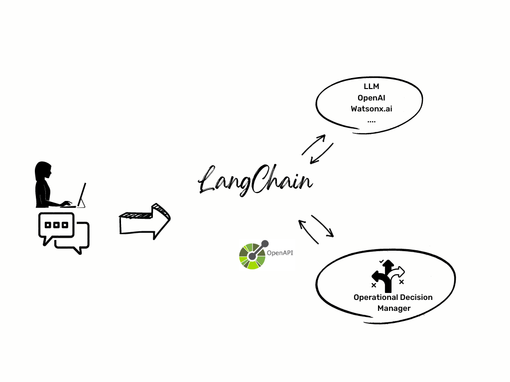

# Introduction
The integration of GenAI with the IBM Operation Decision Manager product, in collaboration with the Langchain project, represents a game-changing milestone in the realms of language generation, decision management, and data analysis. By combining the generative capabilities provided by LLMs coming from OpenAI or Watsonx with the robust decisioning features of IBM ODM and the integration technology of Langchain, users can unlock a multitude of benefits that significantly enhance their decision-making processes. This integration offers a seamless and comprehensive solution for businesses aiming to harness the power of language generation for automating your business decisions.

## LangChain
[LangChain](https://python.langchain.com/en/latest/) is a framework for developing applications powered by language models. The most powerful and differentiated applications will not only call out to a language model via an api, but will also:

  * Be data-aware: connect a language model to other sources of data
  * Be agentic: Allow a language model to interact with its environment

As such, the LangChain framework is designed with the objective in mind to enable those types of applications.

There are two main value props the LangChain framework provides:

   * Components: LangChain provides modular abstractions for the components neccessary to work with language models. LangChain also has collections of implementations for all these abstractions. The components are designed to be easy to use, regardless of whether you are using the rest of the LangChain framework or not.
   * Use-Case Specific Chains: Chains can be thought of as assembling these components in particular ways in order to best accomplish a particular use case. These are intended to be a higher level interface through which people can easily get started with a specific use case. These chains are also designed to be customizable.

# Interact with an IBM ODM decision service trace.

In this sample we will show you how to query Decision Service data execution traces through natural language. You can select your dataset, express metrics and KPIs in plain text.
This integration uses the [Spark LangChain integration](https://python.langchain.com/en/latest/modules/agents/toolkits/examples/spark.html?highlight=spark).

Find the installation instructions at [directory](chat-with-executions-data). 

# Interact in natural language to invoke a decision service

In this sample we leverage the miniloan decision service provided as a sample in IBM ODM. The [LangChain OpenAPI Chain](https://python.langchain.com/en/latest/modules/chains/examples/api.html) will be used to interact with the "MiniLoan" decision service. Utilizing the Swagger API generated dynamically by the ODM Runtime, this integration will allow for natural language interaction with the ODM product without any changes to the product itself.

The instructions to install it can be found in this [directory](chat-with-loandecisionservice).

# Interact with ODM Business console

The integration of the Swagger REST API of the ODM Business Console with the LangChain project offers a unique opportunity to combine the strengths of decision management and LLM technology. In this project, we will utilize the [LangChain Swagger Agent API](https://python.langchain.com/en/latest/modules/agents.html). This API acts as a natural language to REST API call converter, making it possible for the ODM Business Console to access the advanced language learning technologies of the LangChain project.

The instructions to install it can be found in this [directory](chat-with-businessconsole).
