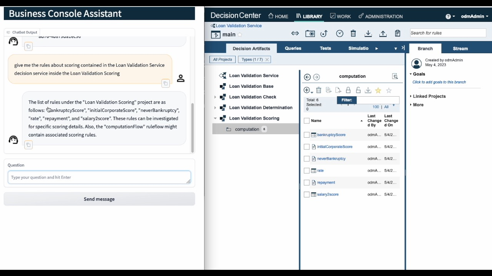
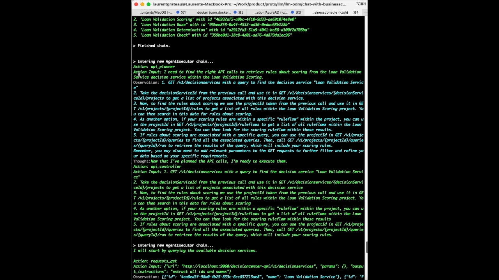

# Introduction 
In the world of software development and service-oriented architecture, integrating different components and systems is crucial for seamless communication and collaboration. Two notable projects, the ODM Business Console and the LLM and LangChain projects, have recognized the importance of this integration. By leveraging the power of the Swagger REST API framework, these projects aim to enhance their capabilities, streamline processes, and promote interoperability.

The ODM Business Console, serves as a comprehensive platform for managing decision-making processes within organizations. It enables users to define, execute, and monitor complex business rules and decisions, facilitating efficient decision management across various domains. With a RESTful API at its core, the ODM Business Console offers a standardized and accessible interface for interacting with its functionalities.

On the other hand, the LLM (Language Learning Management) project and the LangChain project share a common goal of revolutionizing language education and fostering multilingualism. The LLM project focuses on building a cutting-edge language learning platform that incorporates advanced technologies like artificial intelligence, natural language processing, and machine learning. The LangChain project, on the other hand, aims to create a decentralized language ecosystem where learners, teachers, and content providers can interact seamlessly, ensuring a rich and diverse language learning experience.

In conclusion, the integration of the Swagger REST API of the ODM Business Console with the LLM and LangChain projects signifies a significant step towards enhanced collaboration, data exchange, and interoperability in the realms of decision management and language education. By leveraging the power of this integration, organizations can unlock new possibilities for efficient decision-making and revolutionize the language learning experience.


## Pre-requisites
  * Python 3.8 or higher
  * docker 
  * An OpenAI account

## Setup Pre-Requisites

### Create a virtual env and install the Python package
```shell
python3 -m venv ~/llmdc
~/llmdc/bin/activate
pip install -r requirements.txt
```

## Run the demo
### Run the ODM for Developers docker image

Open a terminal
```shell
docker run -e USERS_PASSWORD=odmAdmin -e LICENSE=accept -p 9060:9060 -p 9443:9443  -m 2048M --memory-reservation 2048M  -e SAMPLE=true icr.io/cpopen/odm-k8s/odm:8.11
```

### Run the Chat application

Open a new terminal
```shell
export ODM_ADMIN_PASSWORD=odmAdmin
export OPENAI_API_KEY=<OPENAI_API_KEY>
python3 app-bc.py
```


Then open a browser to this url : http://127.0.0.1:7860


Here some questions you can ask :  
  * what is the ODM system patch level?
  * Give me the list of decision service names






