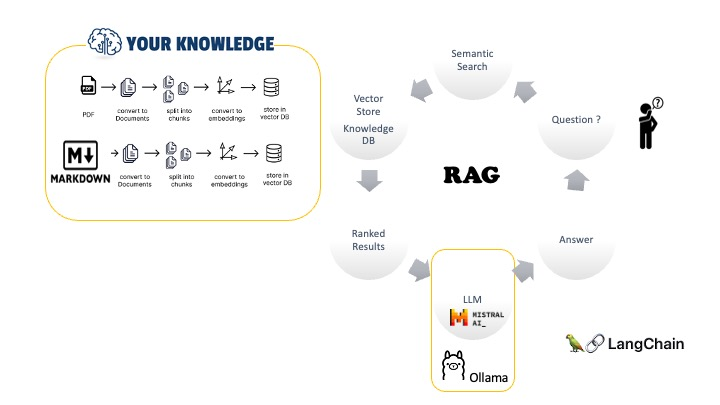

## Introduction 
In the fast-paced world of technology and business, staying up-to-date with complex software like IBM's Operational Decision Management (ODM) can be a challenging task. To simplify this process and provide a user-friendly experience, we present a code sample that demonstrates the development of an interactive chat bot powered by LangChain, utilizing vector and RAG architecture. This chat bot aims to facilitate the exploration and understanding of ODM by indexing its documentation and offering real-time assistance, all within the convenience of your local desktop, including the Apple Mac M1.

The core of this chat bot leverages the LangChain open-source program, which combines the power of vector embeddings and the Retrieval-Augmented Generation (RAG) architecture to efficiently index and retrieve information from ODM documentation. Users can pose questions about the installation, configuration, and usage of ODM, and the chat bot will respond with precise and contextually relevant information.

To enhance the conversational experience and provide a more human-like interaction, the chat bot integrates the OpenSource Mistral.ia LLM model, in conjunction with Ollama, to create a dynamic and engaging dialogue with the user. This combination of technologies allows for a natural conversation flow, making it easier than ever to access and comprehend the wealth of information contained in ODM's documentation.

In this code sample, we will guide you through the process of setting up and running the chat bot on your Apple Mac M1 desktop. Whether you're a seasoned ODM user or just starting out, this tool will help you navigate the intricacies of ODM with ease, ensuring a smoother and more efficient user experience.

Join us on this exciting journey to unlock the full potential of IBM's Operational Decision Management product and discover how this innovative chat bot can be your trusted companion in your quest for knowledge and assistance. Let's dive into the code and see how you can harness the power of LangChain, vector embeddings, RAG architecture, and conversational AI to master ODM.


## Architecture

In this prototype we use the RAG architecture.
In the context of artificial intelligence, RAG stands for “Retrieval-Augmented Generation”. It is a relatively new technique that improves the quality of generative AI systems by allowing large language models (LLMs) to access additional data resources without needing to be retrained. In other words, RAG optimizes the output of an LLM with targeted information without modifying the underlying model itself. This targeted information can be more up-to-date than the LLM and specific to a particular organization or industry. This means that the generative AI system can provide more contextually appropriate responses to prompts and base them on extremely current data.
By this way, we are able to augment the LLM model with the ODM documentation. 

## Pre-requisites
  * Python 3.8 or higher

## Setup Pre-Requisites

### Create a virtual env and install the Python package
```shell
python3 -m venv ~/llmchatwithdoc
~/llmchatwithdoc/bin/activate
pip install -r requirements.txt
```

### Install Ollama
[Ollama](https://ollama.ai/) allows you to run open-source large language models, such as Llama 2, locally.

Ollama bundles model weights, configuration, and data into a single package, defined by a Modelfile.

It optimizes setup and configuration details, including GPU usage.

1. [Download and run](https://ollama.ai/download) the app
2. Once Ollma is up and running, you should download a model. For this sample we will used Mistra model.
For a complete list of supported models and model variants, see the [Ollama model library](https://ollama.ai/library).

From command line, fetch the mistra model.
```ollama pull mistral```

When the app is running, all models are automatically served on localhost:11434

### Prepare your data

In the doc directory put any ODM documentation that you want to chat with:
```shell
cd doc
git clone https://github.com/DecisionsDev/odm-docker-kubernetes
wget --no-check-certificat https://www.ibm.com/docs/en/SSQP76_8.12.0/pdf/odm-8.12.0-documentation.pdf
..
```

Then create a [vector store](https://js.langchain.com/docs/modules/data_connection/vectorstores/) of your documents by running this command.
```shell
python3 prepare-data.py                      
```

### Run the Chat application

Open a new terminal
```shell
python3 odm-support-console-chat.py
```

Here is some questions you can ask to the ODM documentation chat bot:

```text
- Prompt: What is the steps to configure ODM with Azure AD ?

Answer:
To configure ODM with Azure AD, you need to create several secrets before installing the ODM instance and using web application single sign-on (SSO). The following steps should be followed:

1. Create an Azure AD tenant: To use Azure AD as your external OpenID Connect server, you will first need to create an Azure AD tenant. This can be done via the Azure portal or by using the Azure CLI.
2. Register an application: Once you have created your Azure AD tenant, you will need to register an application in that tenant. This will allow your ODM instance to authenticate with Azure AD and use it as an external OpenID Connect server.
3. Configure Azure AD: After registering your application, you will need to configure Azure AD to allow authentication from your ODM instance. This can be done by granting the necessary permissions to the application in the Azure portal.
4. Install and configure ODM: Once you have configured Azure AD, you can install and configure the ODM instance on your Kubernetes cluster. You will need to provide the necessary secrets for authentication and authorization during installation.
5. Configure web application SSO: Finally, you will need to configure web application SSO in your ODM instance. This will allow users to sign in to the ODM using their Azure AD credentials and be automatically authenticated for subsequent requests to the ODM.

By following these steps, you can successfully configure ODM with Azure AD and use it as an external OpenID Connect server for web application SSO.

- Prompt: could describe the step 1

Answer:
Creating an Azure AD tenant is the first step in configuring the Operational Decision Manager (ODM) with an external OpenID Connect (OIDC) provider such as Azure AD. Here are the general steps to create a new Azure AD tenant:

1. Sign in to the Azure portal and navigate to the Azure Active Directory service.
2. Click on the "Create a tenant" button and provide a name for your new tenant. You can also select a subscription and resource group, if desired.
3. Next, you will need to create an application registration in your tenant. This will be used to authenticate your ODM instance with Azure AD. To do this, click on the "App registrations" section and then click on the "New registration" button. Provide a name for your application and select the appropriate supported account types (e.g. individual users or groups).
4. Once your application is created, you will need to assign it the necessary permissions to access Azure AD resources. You can do this by navigating to the "API permissions" section and clicking on the "Add a permission" button. Select the appropriate APIs and actions that your ODM instance will need to access in order to authenticate users.
5. Finally, you will need to configure the Azure AD tenant settings such as domain name, primary email address, and administrator email address. These settings will be used by your ODM instance to connect to Azure AD and manage user authentication.
6. You can also create users or groups in the Azure AD tenant for use with web application single sign-on (SSO) and assign them to the appropriate applications.
7. You need to make sure that you have the necessary permissions to configure the Azure AD tenant, as well as the Kubernetes cluster where you will be installing the ODM instance.
8. Once the Azure AD tenant is created and configured, you can proceed with creating the secrets required for installing the ODM instance and configuring it to use Azure AD as the external OIDC provider.

....
```
