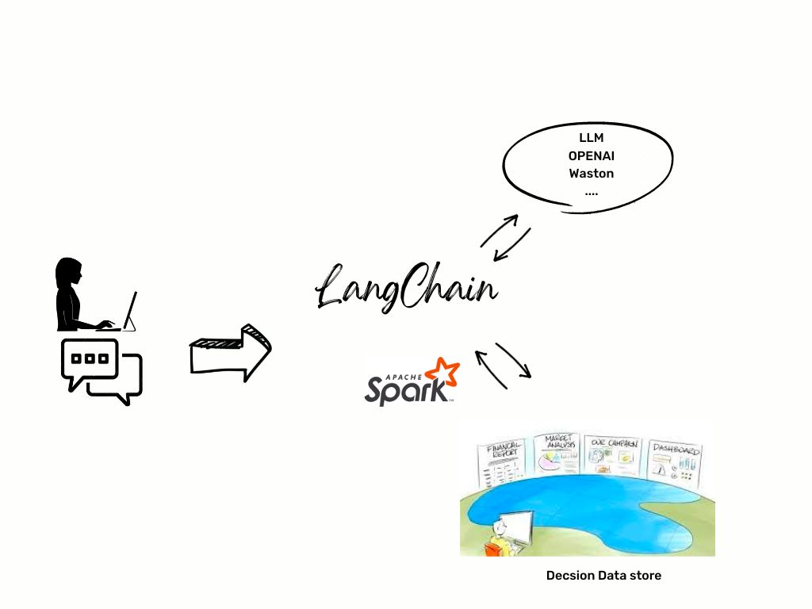

## Introduction 
The integration of Large Language Models (LLMs) with Spark technology offers a groundbreaking solution for querying decision metrics in a data lake environment. By harnessing the power of LLMs, organizations can leverage natural language processing capabilities to extract valuable insights from their data lakes. Spark, a fast and distributed data processing engine, complements LLMs by providing scalable and efficient data processing. This integration empowers technical teams and data analysts to unlock the full potential of their data assets, enabling them to make informed decisions based on comprehensive and contextually relevant metrics.



## Pre-requisites
  * Python 3.8 or higher
  * docker 
  * An OpenAI account

## Setup Pre-Requisites

### Create a virtual env and install the Python package
```shell
python3 -m venv ~/llmdc
~/llmdc/bin/activate
pip install -r requirements.txt
```

## Run the demo

### Run the Chat application

Open a new terminal
```shell
export OPENAI_API_KEY=<OPENAI_API_KEY>
python3 app-loan.py
```


Then open a browser to this url : http://127.0.0.1:7860

Then you can ask queston to the chat bot such as:
  * As an end user describe me the format of the dataset from the column name
  * what is the number of the rejected loan applications ?
  * What is the sum of the accepted loans amount ?

### Code explain
This code is agnostic of the data format. Spark allow to infer the schema data that allow to make the query.


1. Read a CSV File that contains 
```python
spark = SparkSession.builder.getOrCreate()
#csv_file_path = "credit-risk-100.csv"
#csv_file_path = "loanvalidation-decisions-10K.csv"
csv_file_path = "loanvalidation-1K.csv"
df = spark.read.csv(csv_file_path, header=True, inferSchema=True)
```


2. Create the LLM Spark Agent
```python
def initializeLLMAgent():
    agent = create_spark_dataframe_agent(llm=OpenAI(temperature=0), df=df, verbose=True)
    return agent
odm_agent = initializeLLMAgent()
```

3. Perform queries
```python
    response['output'] = odm_agent(query)
```
