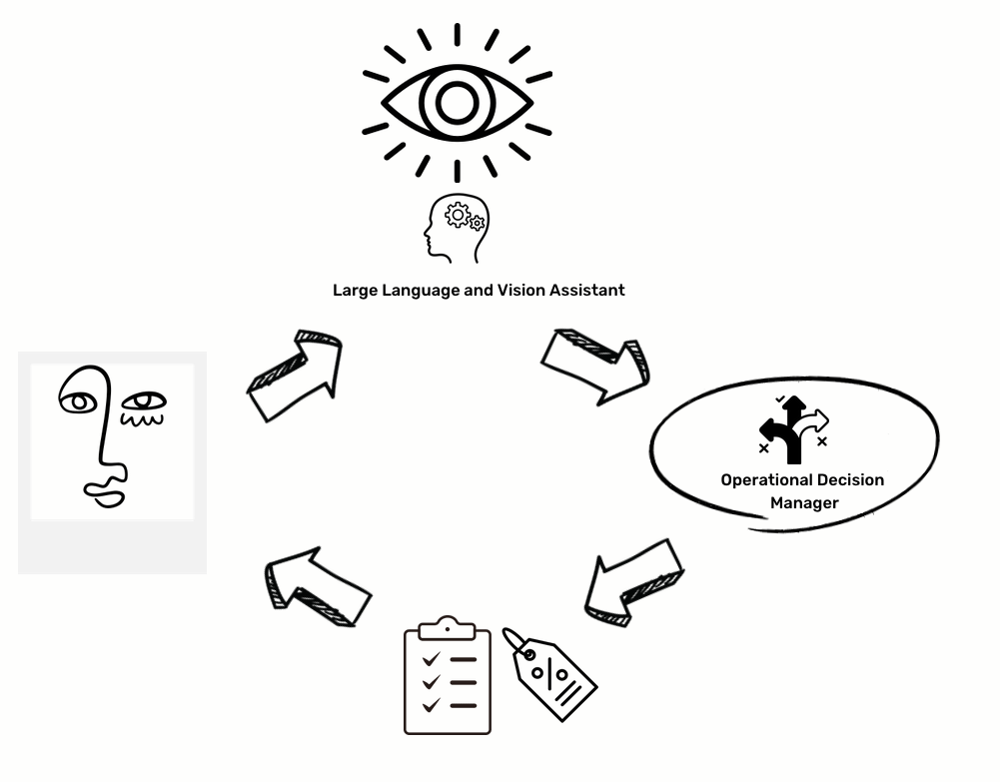
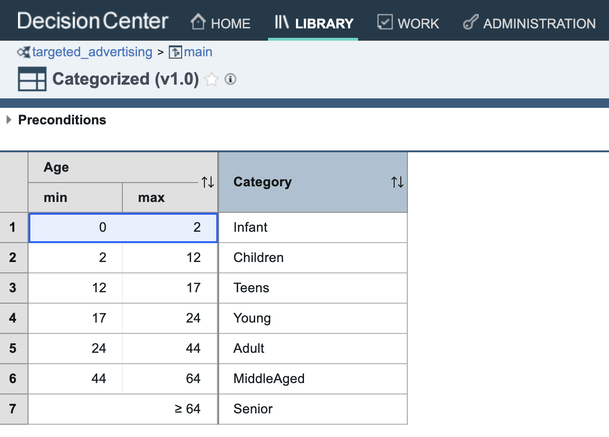
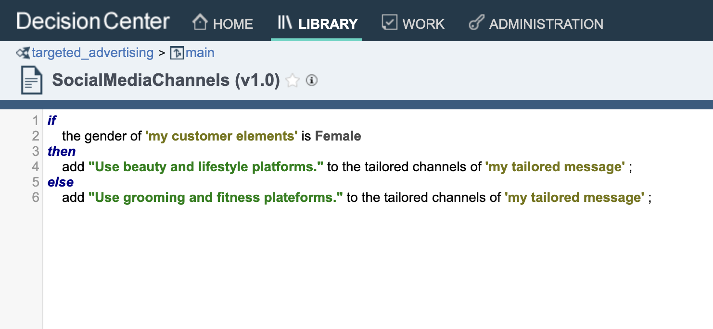

## Introduction 
In the rapidly advancing field of artificial intelligence, the integration of symbolic AI systems like Operational Decision Management (ODM) with cutting-edge computer vision models such as Llava presents a groundbreaking approach. ODM, a platform known for its robust rule-based decision-making capabilities, excels in structuring complex logic and business rules into coherent, manageable systems. This enables precise, consistent decision-making processes across various business applications, from finance to healthcare.

Conversely, Llava, a state-of-the-art computer vision model, epitomizes the pinnacle of deep learning's ability to interpret and analyze visual data. By transforming raw images and video into actionable insights, Llava extends the boundaries of how machines understand and interact with the visual world around them.

The fusion of ODM's logical rigor with Llava's perceptive prowess creates a symbiotic AI system that leverages the strengths of both symbolic reasoning and deep learning. This article aims to showcase, through practical code demonstrations, the synergistic benefits of combining ODM's rule-based intelligence with Llava's visual acuity. By doing so, we can tackle more nuanced and complex problems that were previously beyond the reach of AI systems operating in isolation.

We will delve into specific scenarios where the ODM-Llava integration unlocks new possibilities, from enhancing automated surveillance systems with intelligent decision-making to revolutionizing medical diagnostics with visually informed rule-based analyses. This exploration will not only highlight the individual strengths of ODM and Llava but also illuminate how their combination paves the way for innovative AI applications that are smarter, more efficient, and more aligned with human-like reasoning and perception.



## Proof of concept 


## How it's work

### Step 1. Initial Image Analysis with Llava Computer Vision Models:

An image undergoes analysis by the Llava computer vision system, which has been trained to identify and extract specific characteristics pertinent to individualized assessment.
Here is the prompt used:
```text
Extract the following information: hair color, age, skin color and gender.
Format the results in JSON text, ensuring to include the fields \"hairColor\", \"age\", \"skinColor\" and \"gender\". 
The expected result characteristics are:
The results must be accurate and reliable.
Gender values should Male, Female or Unknown
age should be a number. 
skinColor should be one of this values Dark, Ebony, Ivory, Light, Medium or Unknown
hairColor should be one of this values  Black, Blonde, Brown, Gray, Red, White or Unknown. 
```

This advanced vision model interprets visual cues from the image and compiles these into a structured JSON format, capturing details such as hair color, age, skin tone, and gender—key elements that could influence subsequent recommendations.

```json
{
 "hairColor": "Dark",
 "age": 28,
 "skinColor": "Light",
 "gender": "Female"
 }
```

### Step 2. Strategic Recommendations via the Decision Server:

The structured data is relayed to the Operational Decision Manager, a sophisticated server designed to synthesize the visual data into actionable insights.
Utilizing a complex set of rules and algorithms, the Decision Server adeptly translates the attributes extracted from the image into a series of personalized recommendations. This could include targeted discounts, bespoke advice, or product suggestions that align with the identified characteristics, thereby increasing the relevance and effectiveness of marketing efforts or sales strategies.
```json
{
   "__TraceFilter__":{
      "none":true,
      "infoTotalRulesFired":true,
      "infoRulesFired":true
   },
   "extractedPictureElements":{
      "hairColor":"Dark",
      "age":28,
      "skinColor":"Light",
      "gender":"Female"
   }
}
```

### Step 3. Output with Transparency and Traceability:

The Decision Server outputs a comprehensive JSON payload that not only contains the finely tuned recommendations but also a set of runtime traces. These traces are crucial for understanding the logic behind each recommendation.
The inclusion of runtime traces is a significant benefit of using the Operational Decision Manager. It ensures transparency and accountability in automated decision-making processes. Stakeholders can trace back every decision to the specific rule or data point that triggered it, allowing for a level of interpretability often lacking in complex AI systems.
```json
{
  // Trace object
  "__decisionTrace__": {
    "executionDate": "2024-02-22T14:19:49.447+0000",
    "totalRulesFired": 13,
    "rulesFired": {
      "ruleInformation": [
        {
          "name": "generation.hair$_$specific.ProductVariety",
          "businessName": "generation.hair_specific.ProductVariety",
          "properties": {
            "property": [
              {
                "value": "ProductVariety",
                "name": "ruleExecutionShortName"
              },
              {
                "value": "ProductVariety",
                "name": "ilog.rules.business_name"
              },
              {
                "value": "generation.hair_specific",
                "name": "ilog.rules.package_name"
              },
              {
                "value": "generation.hair$_$specific.ProductVariety",
                "name": "ruleExecutionName"
              },
              {
                "value": "brm.ActionRule:8:8",
                "name": "ilog.rules.teamserver.elementID"
              },
              {
                "value": "",
                "name": "ilog.rules.dt"
              },
              {
                "value": "generation.hair$_$specific",
                "name": "packageExecutionName"
              },
              {
                "value": "new",
                "name": "status"
              }
........
            ]
          }
        }
      ]
    }
  },
  "__DecisionID__": "48921167-0cbd-40ba-8680-e14def9a68080",
// Decsion Results
  "adProposal": {
    "tailoredProductNames": [],
    "tailoredMessaging": [
      "Emphasize shine and volume for the shampoo.",
      "Employ more sophisticated and mature language for older demographics.",
      "Propose color protection for dyed hair."
    ],
    "tailoredProducts": [
      "Anti-aging cream to reduce fine lines and wrinkles.",
      "Use softer colors and elegant design product.",
      "Propose our new shampoo for Blond hairs."
    ],
    "tailoredChannels": [
      "Utilize social media platforms like Instagram and Snapchat.",
      "Use beauty and lifestyle platforms."
    ],
    "discount": 0
  },
  "debugInfo": {
    "messages": [
      "No enum constant com.ibm.rules.addemo.HairColor.Dark"
    ]
  },
  "ageCategory": "Adult",
  "customerElements": {
    "skinColor": "Light",
    "hairColor": "Unknow",
    "gender": "Female",
    "age": 28
  }
}
```
### Step 4. Enhanced Decision Repository for In-depth Analysis:

The runtime traces are more than just a log; they provide an entry point to a deeper decision repository. Here, users can delve into the decision-making framework, examining the intricate web of rules and data that inform the engine's outputs.
This repository acts as a knowledge base, empowering users to refine decision logic, audit outcomes for compliance, and enhance the decision-making process over time based on historical data and outcomes analysis.

In essence, the Operational Decision Manager in this architecture is not just a cog in the machine but a dynamic tool that brings several benefits. It enhances customer engagement by personalizing interactions, improves the decision-making process through learning and adaptation, and upholds the principles of explainable AI by making its processes transparent and understandable to human operators.
<table><tr><td></td><td></td></tr></table>


## Pre-requisites
  * Docker
  * docker-compose
  * Macbook M1 or equivalent. 

Tested on Macbook and Windows 11.

## Running the sample
### Install Ollama
[Ollama](https://ollama.ai/) allows you to run open-source large language models, such as Llama 2, locally.

Ollama bundles model weights, configuration, and data into a single package, defined by a Modelfile.

It optimizes setup and configuration details, including GPU usage.

1. [Download and run](https://ollama.ai/download) the app
2. Once Ollma is up and running, you should download a model. For this sample we will used llava:v1.6 model.
For a complete list of supported models and model variants, see the [Ollama model library](http://ollama.ai/library).
3. From command line, fetch the llava model.
   
```shell
ollama pull llava:v1.6
```

When the app is running, all models are automatically served on [localhost:11434](http://localhost:11434)
> In some OS configuration you should [allow additional web origins to access Ollama](https://github.com/ollama/ollama/blob/main/docs/faq.md#how-can-i-allow-additional-web-origins-to-access-ollama)

### Run the application

1. Open a new terminal
2. Build the docker demonstration 
```shell
docker-compose build
```
Once the build is finished.

3. Run the demonstration
```shell
docker-compose up
```
This will run the ODM for Developpers docker images in conjonction with the sample web application.

4. Wait a couple of minutes until you see this message  ```Running on local URL:  http://0.0.0.0:7860```
5. Then open a browser to this url : http://localhost:7860

and select or upload or take a photo then click the ***```Analyse Image```*** button.

You can browse to Rules that is applyied in the sample by :

Open Decision Center at this location : http://localhost:9060/decisioncenter

* Username : ***odmAdmin***
* Password : ***odmAdmin***


